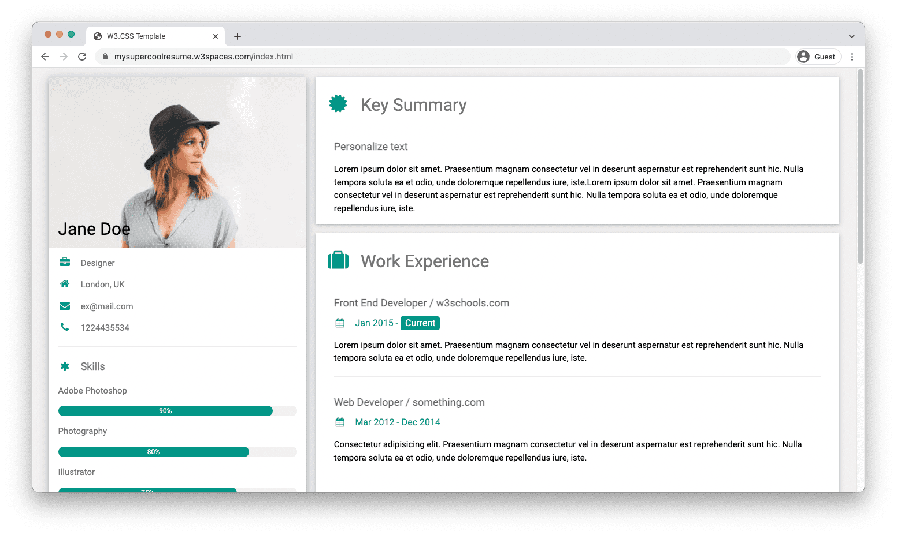
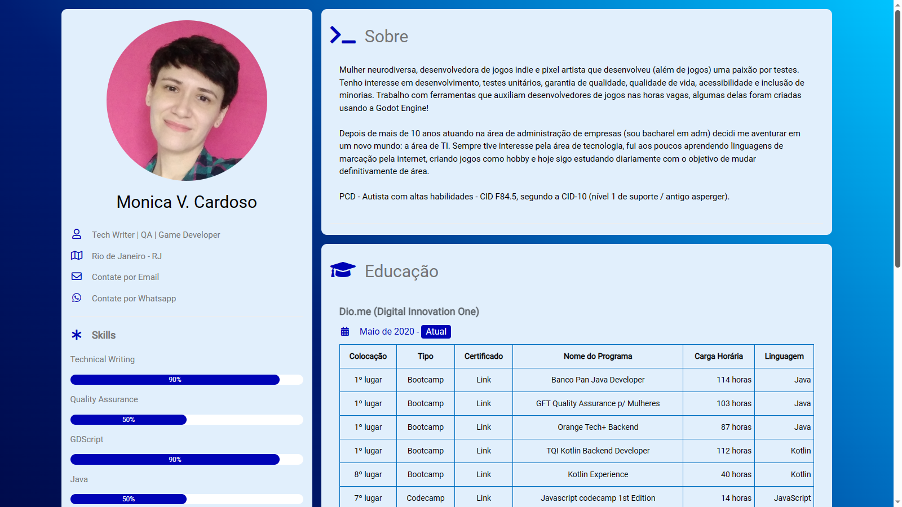

# Curriculum Vitae Online

O presente repositório tem como objetivo montar uma replica de um CV Online, utilizando conceitos de html, css e Github Pages. Essa é a aparência do projeto base que está disponível no [site da w3schools](https://www.w3schools.com/howto/howto_website_create_resume.asp):

  

Decidi colocar um pouco mais de personalidade na página, adicionando um gradiente como background e cores um pouco menos claras na página no geral. Atualizei a versão do FontAwesome para 5, pois gosto mais de alguns ícones presentes nela e incluí uma table com todas as minhas conquistas dentro da plataforma [Dio.me](https://www.dio.me/), das quais tenho **muito orgulho**!  
A seguir veja uma prévia de como está o projeto depois dessas modificações:

**Acesse o Projeto Original (Versão da DIO):** 

https://github.com/digitalinnovationone/cv

**Referências:**

W3C: https://www.w3schools.com/howto/howto_website_create_resume.asp
